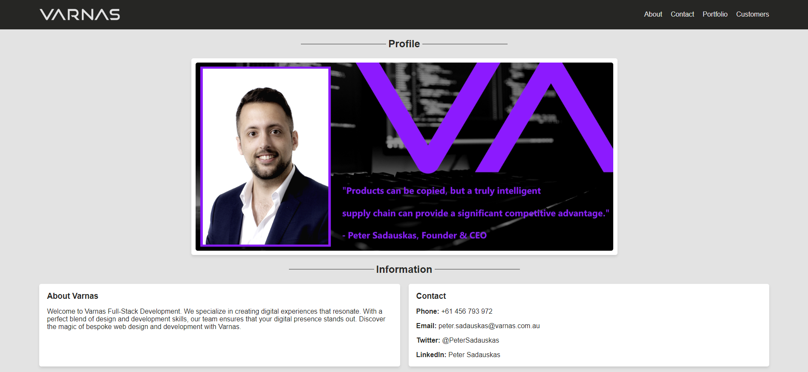
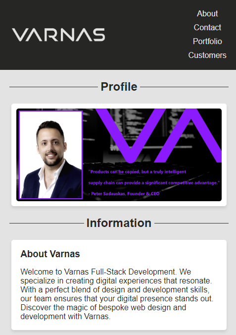
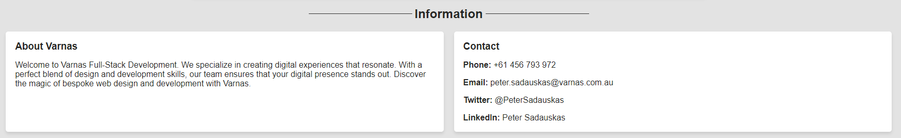
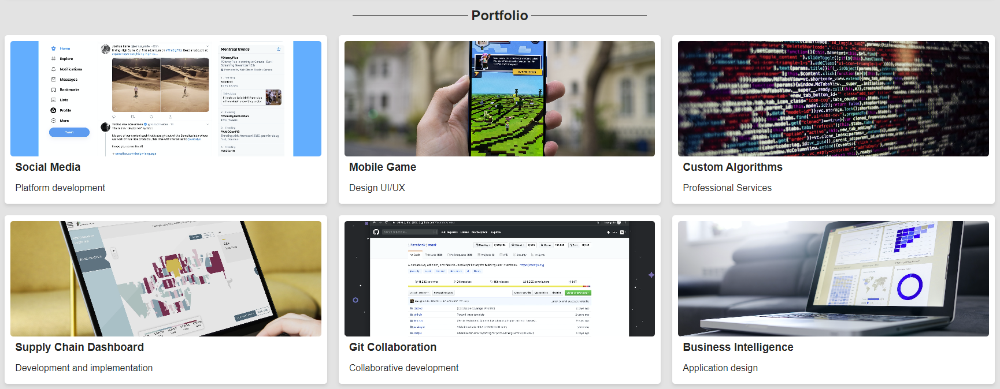
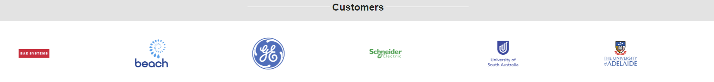

# Varnas Portfolio Website

This repository contains the source code for my portfolio website, showcasing my skills, work experience, and projects. As a budding developer, this site is a work-in-progress and serves as both a demonstration of my abilities and a learning tool.

## Table of Contents

- [Description](#description)
- [Features](#features)
- [Installation](#installation)
- [Usage](#usage)
- [Contribute](#contribute)
- [Credits](#credits)
- [License](#license)

## Description

This project is a static website built using HTML and CSS. It's designed to be responsive and mobile-friendly, providing a seamless experience across different device sizes.

## Features

### 1. Responsive Design

The site adjusts its layout based on the device's screen size, ensuring it looks great on both desktop and mobile.

### 2. About & Contact Section

I have included a description of my company and the services we offer. I have also included a section for direct contact details.

### 3. Portfolio Section

While I'm currently in the early stages of my coding journey and do not have deployed projects, I've set up a placeholder page that will be replaced with links to real projects in the future.

### 4. Customer Slider

I have added a slider to showcase all of the customers that I have worked with in order to give potential customers confidence to buy my services.

## Installation

1. Clone the repository: git clone git@github.com:KobayashiKerfuffle/varnas-portfolio.git

2. Navigate to the project directory: cd portfolio-website

3. Open `index.html` in your preferred browser.

## Usage

Simply visit https://kobayashikerfuffle.github.io/varnas-portfolio/ to view the live site.

## Contribute

If you have suggestions or want to improve any aspects of this site, feel free to fork the repository and create a pull request.

## Credits

- All design and code by Peter Sadauskas.

## License

[MIT License](./LICENSE)